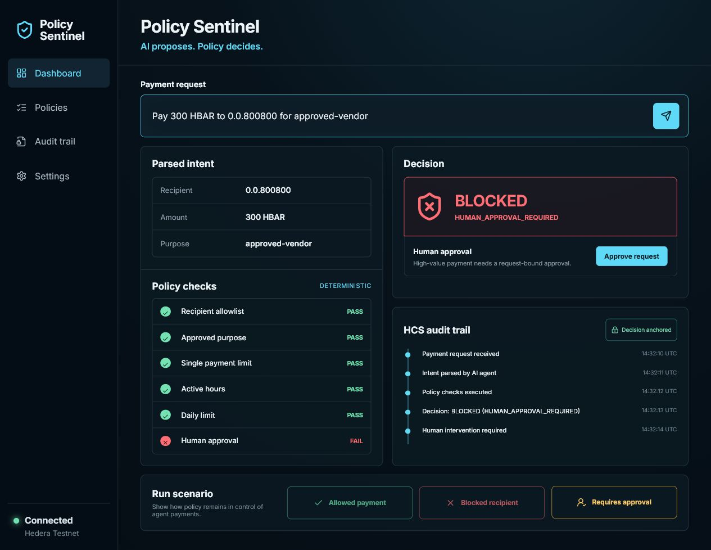

# Hedera Policy Sentinel



Hedera Policy Sentinel is a policy-constrained payment agent for the Hedera AI Agent Bounty. It combines AI-friendly payment intents with deterministic controls that cannot be bypassed by an LLM.

## Why It Matters

AI can interpret a user's request, but it should never have the final word on moving funds. Policy Sentinel places Hedera Agent Kit policies directly in the transaction lifecycle, before signing and submission.

Every payment is checked for:

- recipient allowlists
- approved business purposes
- single-payment and cumulative daily limits
- UTC execution windows, including overnight windows
- short-lived human approvals above configurable thresholds
- deterministic SHA-256 audit digests anchored to Hedera Consensus Service
- post-execution payment history for cumulative daily-limit enforcement

## Agent Kit Integration

`HederaSpendingPolicy` extends Hedera Agent Kit's `AbstractPolicy` and runs after parameter normalization but before a transfer transaction is formed and submitted. A transaction memo carries the payment request ID, purpose, and optional human approval token.

```ts
const guard = new HederaSpendingPolicy(policy, history, approvals);

const context = {
  mode: AgentMode.AUTONOMOUS,
  accountId: operatorId,
  hooks: [
    guard,
    new HcsAuditTrailHook(["transfer_hbar_tool"], auditTopicId),
  ],
};
```

`HcsDecisionAuditSink` anchors every allow or block decision to Hedera Consensus Service before funds move. If the HCS audit write fails, the policy fails closed and the transaction does not continue.

## Run Locally

No wallet, private key, or paid AI API is needed for the local policy demo and tests.

```powershell
npm.cmd install
npm.cmd test
npm.cmd run demo
npm.cmd run build
```

## Run The AI Agent On Testnet

The optional AI entry point translates natural-language requests into Hedera Agent Kit tool calls. The LLM cannot bypass `HederaSpendingPolicy`; each decision must also be recorded to HCS before execution continues.

```powershell
npm.cmd run agent -- "Pay 10 HBAR to 0.0.800800 for cloud-infrastructure"
```

Use only a dedicated testnet account and provide values through local environment variables. No credentials belong in source control.

## Safety Model

- LLMs may translate natural-language requests into structured payment intents.
- Deterministic policies always make the final allow/block decision.
- High-value payments require explicit, request-bound, expiring human approval.
- No private key is stored in this repository.
